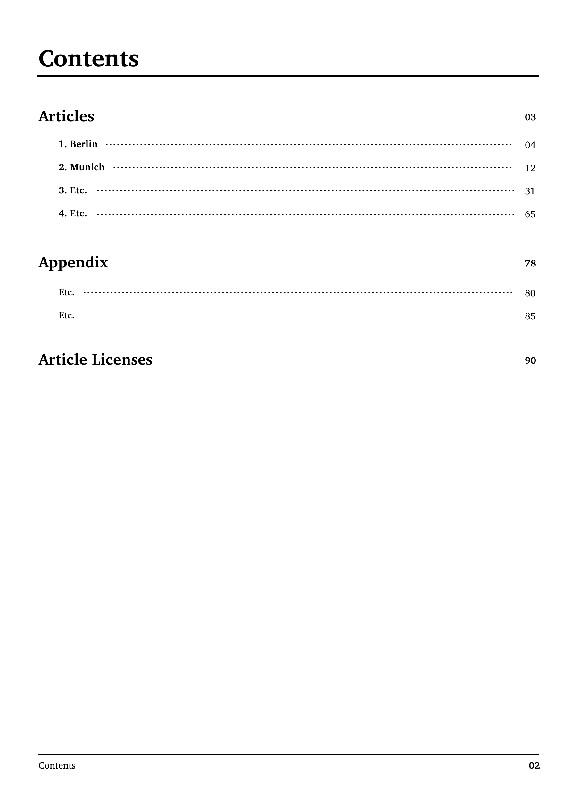

# mwlib.pdf PDF writer

## Overview
This is a MediaWiki to PDF renderer based on the HTML of MediaWiki pages. Since Wikipedia's original output format is HTML, we found that relying on HTML proves to be more reliable than the Wikimarkup used in other PediaPress renderers created previously. The main benefit is that developers can work with familiar technologies like HTML and CSS and face fewer frictions than when converting to different rendering technologies like LaTeX, ODF or DocBook.

Under the hood, the renderer uses [PrinceXML](https://www.princexml.com/) which fully supports the [CSS Paged Media](https://www.w3.org/TR/css-page-3/) and allows for rendering print-specific elements like table-of-contents and page numbers directly from a HTML/CSS source.

The target output should look like this (thanks [Alex Hollender](https://meta.wikimedia.org/wiki/User:AHollender_(WMF)) 
for the designs):

<div>
 <kbd></kbd>
 <kbd></kbd>
 <kbd></kbd>
 <kbd></kbd>
<div>
 
## Installation

The PDF renderer requires PrinceXML for creating PDF files:
* [Download Prince](https://www.princexml.com/download/)
* Put the `prince` binary in your path (e.g. `/usr/local/bin/prince`)
* Check that prince is working correctly

If Prince is installed correctly, you should see something like this on the command line:
```
~$ prince
Usage:
  prince [OPTIONS] doc.html              Convert doc.html to doc.pdf
  prince [OPTIONS] doc.html -o out.pdf   Convert doc.html to out.pdf
  prince [OPTIONS] FILES... -o out.pdf   Combine multiple files to out.pdf

Try 'prince --help' for more information.

```

Now, you are ready to `make install` to get started.

## Getting Started
To render a few arbitrary article from the English Wikipedia, enter the following commands:
```
$ mw-zip -o scripts.zip -c :en 'Chinese characters' 'Japanese writing system' 'Cyrillic script' 'Indo-Aryan languages'
$ mw-render -wpdf -c scripts.zip -o scripts.pdf
```

To learn more about the various options of `mw-zip` use `mw-zip --help`. 

To learn more about the various options of `mw-render` use `mw-render --help`.

## Math Formulas
Currently, rendering Math Formulas requires TeX (`xelatex`). Math formulas are cached as SVG files 
with a hashed name. Please keep an eye on the `math_formulas` folder since there is no cache 
management.

The full installation of TeXLive is pretty large (2.5GB). Fortunately, for our purposes 
a basic distribution and a few additional packages are sufficient.

On a Mac, a good starting point is to install [BasicTeX](https://tug.org/mactex/morepackages.html).
Other operating systems might have similar "basic" distributions.

After the basic installation completed, use [tlmgr](https://www.tug.org/texlive/tlmgr.html) to install required additional packages:
```
$ sudo tlmgr update --self
$ sudo tlmgr install collection-fontsrecommended
$ sudo tlmgr install cancel
$ sudo tlmgr install AMSmath
$ sudo tlmgr install dvisvgm
``` 

## Contributing
As you will see, rendering has a lot of room for improvement.

Pull requests are welcome.
 
## MIT License

Copyright (c) 2019 PediaPress GmbH

Permission is hereby granted, free of charge, to any person obtaining a copy
of this software and associated documentation files (the "Software"), to deal
in the Software without restriction, including without limitation the rights
to use, copy, modify, merge, publish, distribute, sublicense, and/or sell
copies of the Software, and to permit persons to whom the Software is
furnished to do so, subject to the following conditions:

The above copyright notice and this permission notice shall be included in all
copies or substantial portions of the Software.

THE SOFTWARE IS PROVIDED "AS IS", WITHOUT WARRANTY OF ANY KIND, EXPRESS OR
IMPLIED, INCLUDING BUT NOT LIMITED TO THE WARRANTIES OF MERCHANTABILITY,
FITNESS FOR A PARTICULAR PURPOSE AND NONINFRINGEMENT. IN NO EVENT SHALL THE
AUTHORS OR COPYRIGHT HOLDERS BE LIABLE FOR ANY CLAIM, DAMAGES OR OTHER
LIABILITY, WHETHER IN AN ACTION OF CONTRACT, TORT OR OTHERWISE, ARISING FROM,
OUT OF OR IN CONNECTION WITH THE SOFTWARE OR THE USE OR OTHER DEALINGS IN THE
SOFTWARE.
